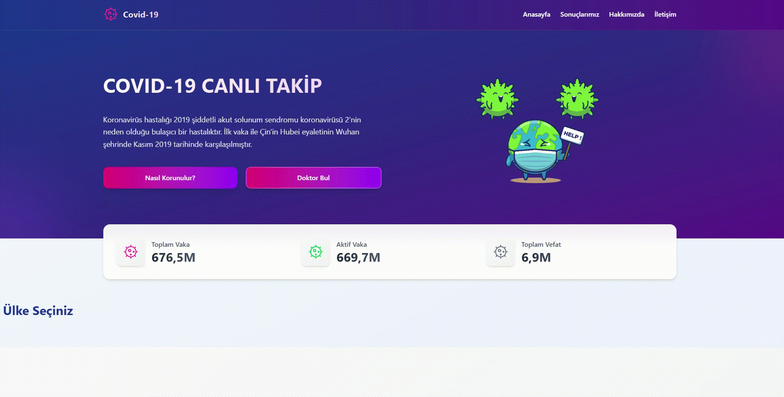

🦠 CovidMap – COVID-19 Canlı Takip Uygulaması

CovidMap, dünya genelindeki COVID-19 vaka sayılarını, aktif vakaları, toplam vefatları ve daha fazlasını canlı olarak görüntülemenizi sağlayan bir web uygulamasıdır.
React ile geliştirilmiş olup RapidAPI üzerinden gerçek zamanlı veriler çekmektedir.

🖼️ Ekran Görüntüsü

🚀 Özellikler

🌍 Gerçek zamanlı COVID-19 istatistikleri

📊 Toplam vaka, aktif vaka, toplam vefat bilgileri

🩺 Doktor bulma ve korunma önerileri sekmeleri

⚡ Hızlı ve modern arayüz

🎨 Responsive tasarım

🔐 API bilgileri .env dosyasında gizlenmiştir

🛠️ Kullanılan Teknolojiler

React + Vite

Redux / Context (kullandıysan)

Axios

RapidAPI – COVID-19 Statistics API

TailwindCss
